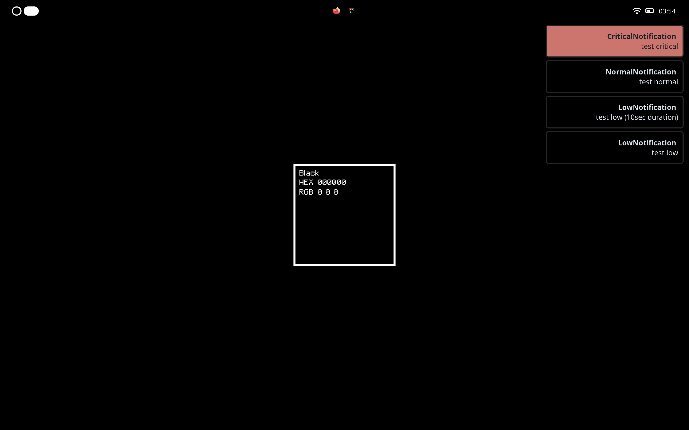
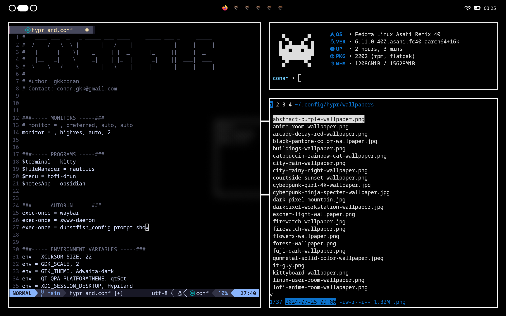

# ~/.dotfiles

 

Welcome to my dotfiles repository! 🌱

These are my personal config files that keep my computing life organized. They might not be perfect, but they make my digital space feel like home.
Roam around and use anything you find helpful.

Let me know if something's wrong and remember: suggestions are always welcome! 📬

## Table of Contents
- [Screenshots](#screenshots)
- [Configs](#configs)
- [TODO](#todo)
- [Customization](#customization)
- [Contributing](#contributing)
- [Credits](#credits)

## Screenshots

|  |  |
| ------------------- | ------------------- |
|  |  |
|  |  |

## Configs
- OS: Fedora
- WM (Window Manager): Hyprland
- File Manager: Nautilus (WIP)
- Browser: Firefox
- Terminal: Kitty
- Shell: Fish
- Editor: VSCodium/Neovim
- Top Bar: Waybar
- Launcher: Rofi
- Basic Control Panel: EWW (WIP)
- Audio Visualizer: Cava
- Notification Daemon: Dunst
- Wallpaper Daemon: Hyprpaper

## TODO
- [ ] Neovim Configs
- [x] Fish Configs
- [x] Switch to rofi as App Launcher
- [ ] Switch to SWWW instead Hyprpaper
- [ ] Notification Center
- [x] Hyprlock Configs

## Customization
Feel free to fork this repository and adjust the configurations to fit your needs. Everyone's workflow is different, and these dotfiles are tailored to mine. Tweak away!

## Contributing
While this repository is mostly for my personal use, I’m open to suggestions and improvements. If you have any ideas, feel free to open an issue or submit a pull request.

## Credits
All configurations and tweaks were created by me, [gkkconan](https://github.com/gkkconan/).
